<div align="center">

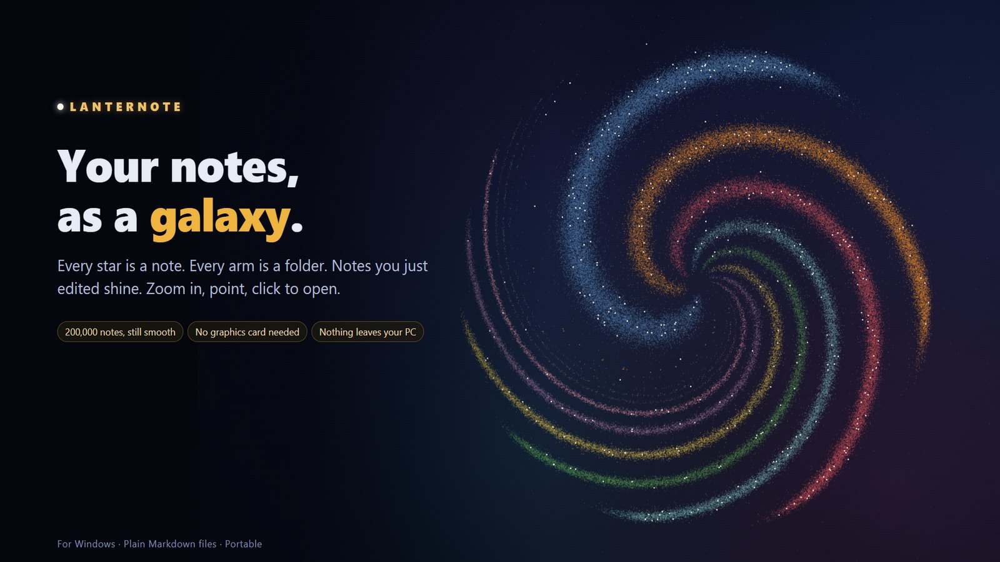

# Lanternote

**A fast, private desktop app for very large folders of Markdown notes.**<br>
Read, edit, search, query and map 200,000 notes on any Windows PC — no account, no cloud, no graphics card needed.

[](https://github.com/ericthai-labs/lanternote/releases)
[](#download)
[](#privacy)
[](LICENSE.txt)

[Download](#download) · [Features](#features) · [Performance](#performance) · [User guide](docs/guide/User-Guide.md) · [Build from source](#build-from-source) · [Changelog](CHANGELOG.md)

</div>

<br>

<p align="center">
  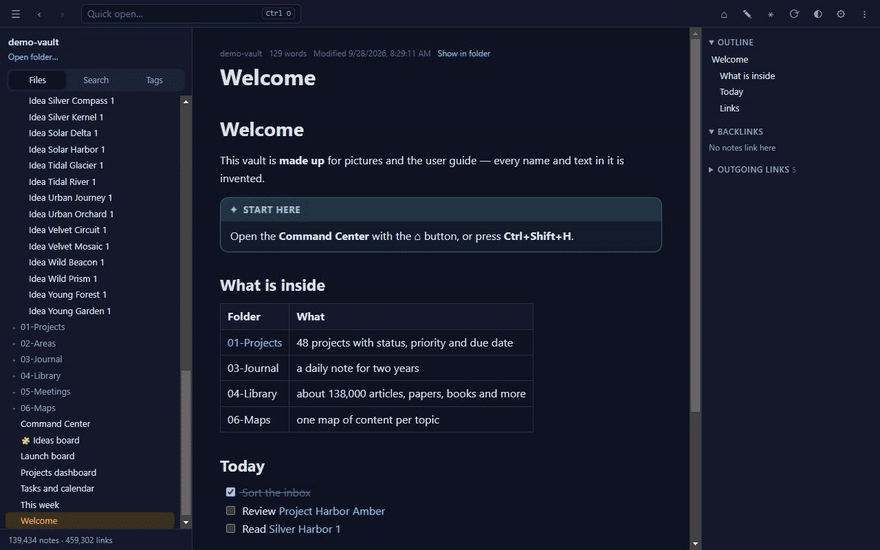
  <br><sub>20 seconds on a made-up folder of 139,434 notes: quick open · full-text search · Command Center · galaxy · link graph</sub>
</p>

## Why Lanternote

- **Built for size.** Tested on a real library of 190,000+ notes and 2.5 million links: it reopens in 1–2 seconds and searches in milliseconds.
- **Runs on any PC.** The link graph and the galaxy are drawn without a graphics card. Portable: one `.exe`, no installation, no admin rights.
- **Your files stay yours.** Plain `.md` files in a folder you choose. Nothing is uploaded, nothing phones home, everything works offline.
- **More than a reader.** Live queries, task lists, calendars, Kanban boards, canvases and a Command Center page — all stored as ordinary Markdown.
- **Works with your AI assistant.** Claude and other MCP assistants can search and, if you allow it, edit your notes — every AI change keeps the old text.

## Features

<table>
<tr>
<td width="50%" valign="top">

### Command Center
One page with what matters today — projects, due dates, open tasks, a calendar, recent notes. It is built from an ordinary note you can edit.

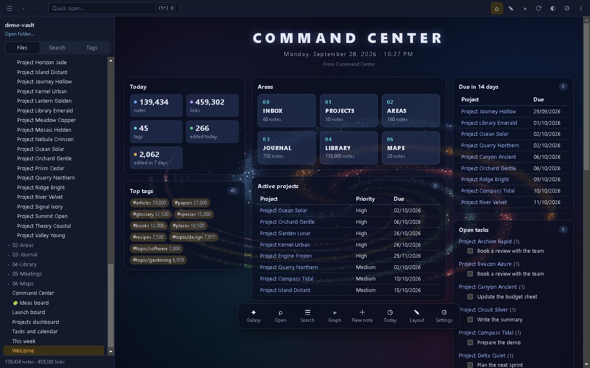
</td>
<td width="50%" valign="top">

### Your notes as a galaxy
Every star is a note, every arm a folder, and notes you edited this week shine. Zoom in to read names, click a star to open it.

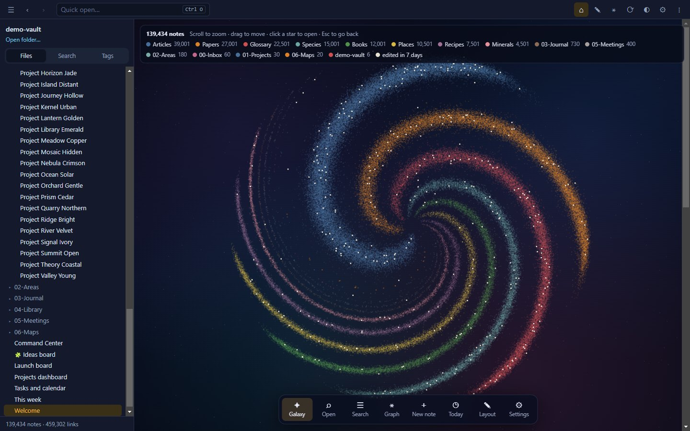
</td>
</tr>
<tr>
<td valign="top">

### Link graph on any PC
The **Map** engine lays out hundreds of thousands of notes once, in the background, and draws them like a digital map — no GPU required. A **Live** GPU engine is there when you have one.

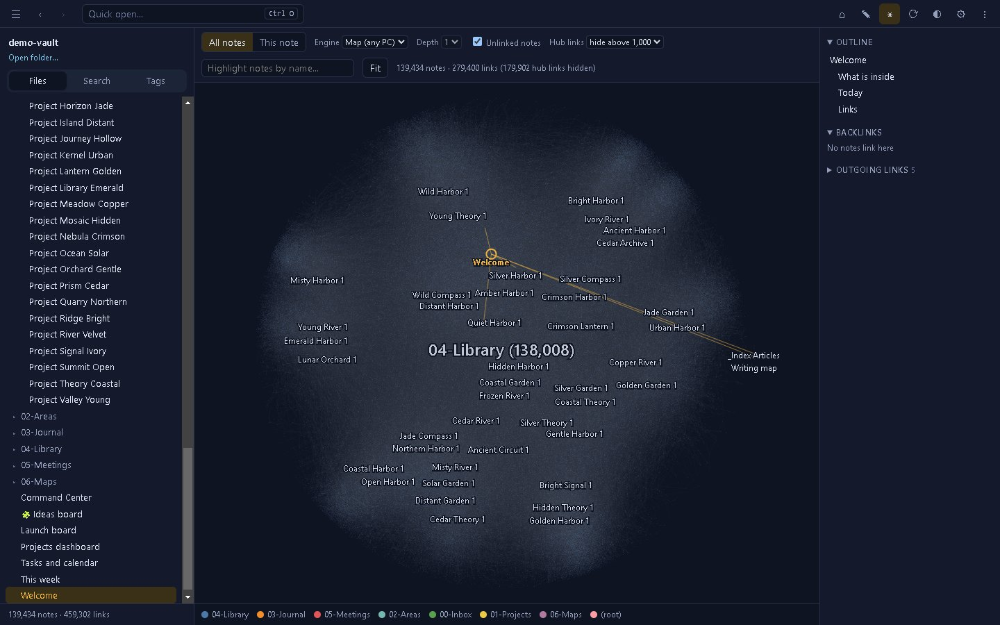
</td>
<td valign="top">

### Editing that protects your work
Auto-save, per-note undo, `[[` and `#` completion, paste images, rename with link updates, and version history. If a file changes on disk while you edit, you choose which version to keep.

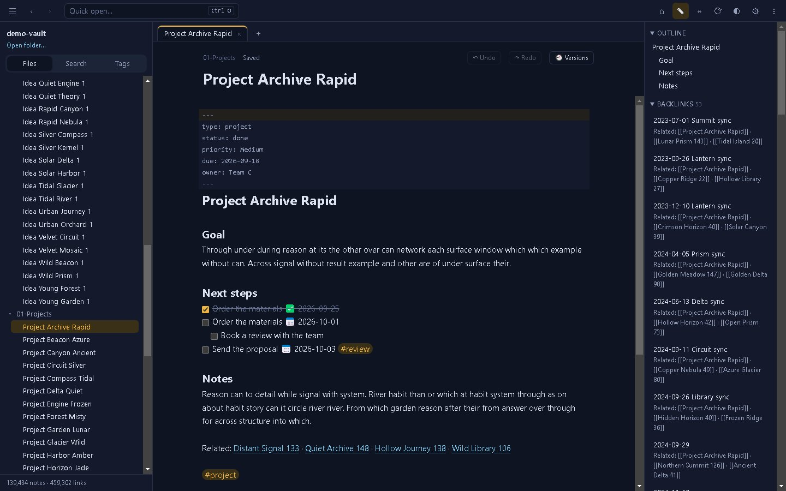
</td>
</tr>
<tr>
<td valign="top">

### Search everything, instantly
Full-text search across every note, accent-insensitive, with `tag:` filters. Quick open (`Ctrl+O`) finds any note by name as you type.

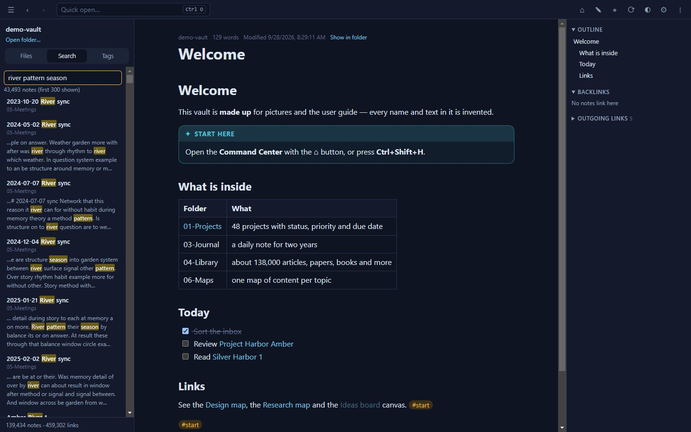
</td>
<td valign="top">

### Live queries
Tables, lists, task lists and month calendars from ` ```dataview ` blocks, written in the Dataview query language — refreshed as your notes change.

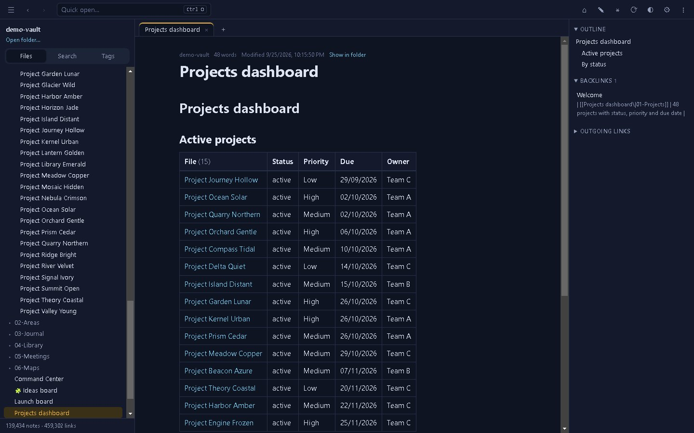
</td>
</tr>
<tr>
<td valign="top">

### Tasks and calendars
Collect tasks from every note, sort them by due date and tick them right in the results — the note is updated on the spot.

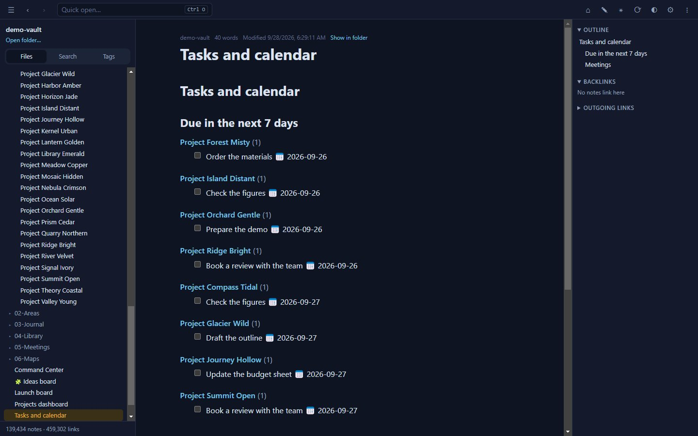
</td>
<td valign="top">

### Kanban boards
Drag cards between lanes. Boards are plain Markdown notes in the common board format, so they stay readable anywhere.

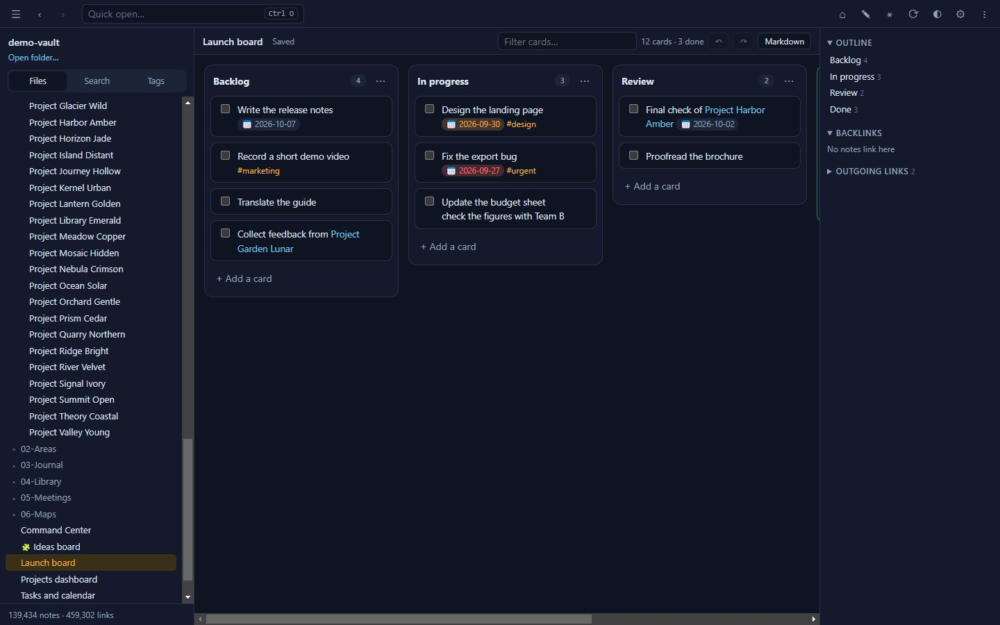
</td>
</tr>
<tr>
<td valign="top">

### Canvas
Lay out notes, text and links on an infinite board. Canvases use the open [JSON Canvas](https://jsoncanvas.org) format.

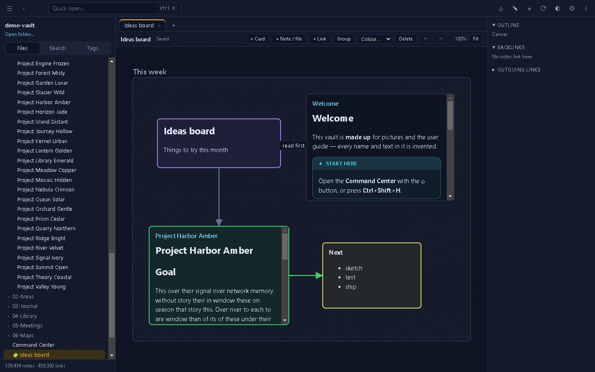
</td>
<td valign="top">

### Connect an AI assistant
Built-in [MCP](https://modelcontextprotocol.io) server: search, read, run queries, list tasks and — only if you allow it — write. Limit it to chosen folders; every change is logged and reversible. For Claude Desktop, just double-click `lanternote-<version>.mcpb` from the release.

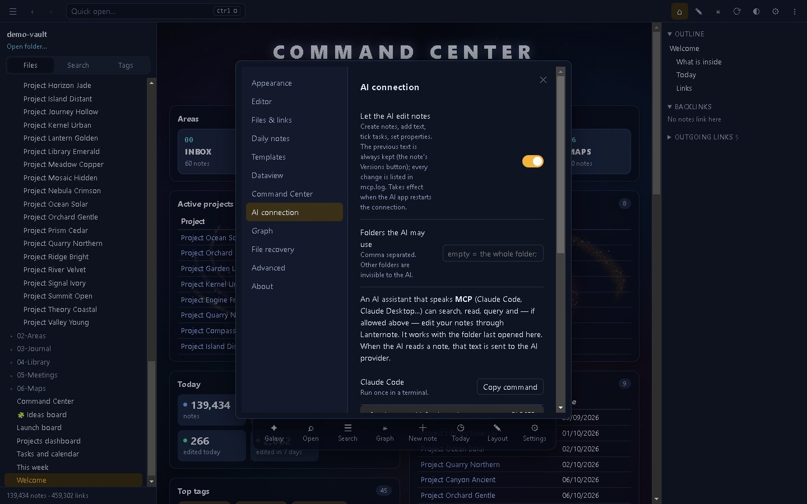
</td>
</tr>
</table>

**Also included:** wiki links with headings, blocks and aliases · embeds (`![[note]]`, images, audio, video) · backlinks and outline · front-matter properties · tags and nested tags · callouts · highlights and comments · Mermaid diagrams · note templates · daily notes · image viewer · command palette · print to PDF · light and dark themes.

<p align="center">
  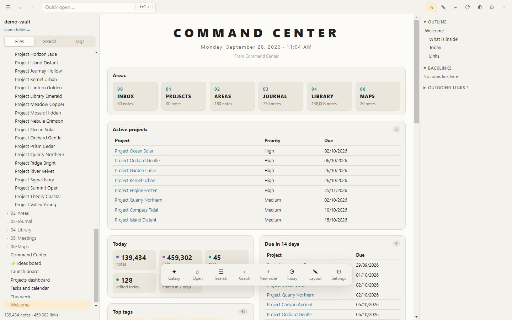
</p>

## Performance

Measured on a real-world library of **190,522 notes, 2.49 million links (728 MB)**, and on a made-up 139,000-note folder used for all pictures in this README.

| Task | Time |
|---|---|
| First open (no cache) | ≈ 17–19 s |
| Reopen (cached) | ≈ 1–2 s — changes are checked in the background |
| Full-text search | 20–130 ms |
| Quick open by name | ≈ 25 ms |
| Live query over the whole library | ≈ 0.1 s |
| Galaxy — one frame | ≈ 1 ms |
| Link graph — build | ≈ 0.15 s |

<details>
<summary><b>How it stays fast</b></summary>

- **A worker thread owns the index** (`indexer.js`): it reads and parses every note, keeps a compact search index (accent-insensitive, 50 MB for the library above) and answers searches and queries. The window only holds a small index — paths plus a `Uint32Array` of links — and reads a note's text when you open it.
- **Disk cache** (`index-cache`): parsed notes and the resolved link graph are cached, so a reopen shows the folder at once and only `stat`s files in the background.
- **Incremental updates**: editing, adding or deleting a file re-reads only that file. Changes made by other apps or by sync tools appear within about a second.
- **Graph "Map" engine** (`layout-worker.js`, `src/atlas.js`): the layout is computed once (Pivot MDS plus neighbour smoothing) and cached; drawing uses level of detail on a 2D canvas, so an idle graph costs no CPU.
- **Graph "Live" engine**: [cosmos.gl](https://github.com/cosmosgl/graph) runs both the force layout and the drawing on the GPU. Links of "hub" notes with more than 1,000 links are hidden by default — one note with 72,000 backlinks alone drops the frame rate from ~120 to ~19 FPS.
- Limits: 1,000,000 files; up to 1.5 GB of text kept for search (beyond that, search covers part of the folder and says so).

</details>

## Download

1. Download `Lanternote-<version>-portable.exe` from the [latest release](https://github.com/ericthai-labs/lanternote/releases/latest).
2. Run it — no installation and no admin rights. For a faster start, use the `.zip` instead and run `Lanternote.exe` inside it.
3. Click **Open a folder** and choose your notes. Next time Lanternote reopens the same folder and note.

**Only want your AI assistant to read your notes?** Download `lanternote-<version>.mcpb` from the same release and double-click it: Claude Desktop installs the extension and asks for your notes folder. It is read-only unless you turn on *Let the AI edit notes*, and it works on Windows, macOS and Linux.

> [!NOTE]
> The app is not code-signed yet, so Windows SmartScreen may warn you: choose **More info → Run anyway**.
> Settings, the index cache and recovery copies are kept per PC in `%APPDATA%\Lanternote`.

Press **F1** in the app for the built-in guide, or read the illustrated [user guide](docs/guide/User-Guide.md).

<details>
<summary><b>Keyboard shortcuts</b></summary>

| Keys | Action |
|---|---|
| `F1` | In-app guide |
| `Ctrl+O` | Quick open |
| `Ctrl+Shift+F` | Search every note (`tag:#name` to filter) |
| `Ctrl+Shift+H` | Command Center |
| `Ctrl+G` / `Ctrl+Shift+G` | Graph of all notes / around this note |
| `Ctrl+N` | New note |
| `Ctrl+E` | Read ⇄ edit |
| `Alt+E` | Insert a template |
| `Ctrl+P` | Command palette |
| `Ctrl+,` | Settings |
| `Ctrl+Shift+D` | Light / dark |
| `Alt+←` / `Alt+→` | Back / forward |
| `Ctrl+−` / `Ctrl+=` / `Ctrl+0` | Zoom out / in / reset |
| `Esc` | Close a dialog, leave the galaxy |

</details>

## Privacy

Lanternote reads and writes only the folder you open and its own settings folder. It has no account, no telemetry and no update check; all libraries are bundled, so it runs without a network connection.

The only exception is one you turn on yourself: when you connect an AI assistant, the notes it reads are sent to that assistant's provider. You can make the connection read-only and limit it to chosen folders.

## Build from source

Requires [Node.js](https://nodejs.org) 22 or later and Git. Build outside folders synced by OneDrive or Dropbox — `node_modules` and the builds are large.

```bash
git clone https://github.com/ericthai-labs/lanternote.git
cd lanternote
npm ci          # installs dependencies and bundles the editor into src/vendor
npm start       # run from source
npm run dist:win   # portable .exe and .zip in dist/
```

<details>
<summary><b>Project layout and tests</b></summary>

| Path | What it does |
|---|---|
| `main.js`, `preload.js` | Main process: file access, folder watching, IPC, the `vault://` protocol for attachments (paths cannot escape the folder) |
| `indexer.js`, `search-index.js` | Worker thread: parsing, disk cache, search, queries |
| `layout-worker.js`, `src/atlas.js` | Graph "Map" engine |
| `src/graph.js` | Graph "Live" engine (cosmos.gl) |
| `src/app.js`, `src/edit.js`, `editor/` | Reader and editor (CodeMirror 6) |
| `src/command.js`, `src/dataview.js`, `src/dvview.js`, `src/kanban.js`, `src/canvas.js` | Command Center, queries, Kanban, Canvas |
| `mcp/lanternote-mcp.js` | MCP server for AI assistants (no extra dependencies); `scripts/make-mcpb.js` packs it as a Claude Desktop extension |
| `tests/`, `scripts/drive.js` | Automated tests that drive the app through DevTools |

```bash
node tests/mcp.js                                    # AI connection, 35 checks
node scripts/drive.js <test-folder> tests/editing.js # UI scenarios — see tests/README.md
node scripts/bench-index.js <folder> <words>         # index and search timings
npm run media -- <work-folder>                        # rebuild guide, adverts and README pictures
```

Every version bump needs a `## x.y.z` entry in [CHANGELOG.md](CHANGELOG.md); `npm run dist:*` stops without one. Run UI tests only on throw-away folders — they create, rename and delete files.

</details>

## Contributing

Bug reports and suggestions are welcome in [Issues](https://github.com/ericthai-labs/lanternote/issues). Pull requests are welcome too; by submitting one you agree that it may be released as part of Lanternote under its licence.

## License

Lanternote is **source-available** under the [PolyForm Noncommercial License 1.0.0](LICENSE.txt):

- ✅ Free for personal use, study and hobby projects, and for noncommercial organisations (charities, schools, public bodies).
- ✅ You may read the code, change it and share changes for noncommercial purposes, keeping the copyright notice.
- ❌ Commercial use — including internal use at a company — needs a separate licence. [Open an issue](https://github.com/ericthai-labs/lanternote/issues) to ask.

Bundled open-source libraries keep their own licences, listed in [THIRD-PARTY-NOTICES.txt](THIRD-PARTY-NOTICES.txt).

## Acknowledgements

Lanternote stands on excellent open-source work, including [Electron](https://www.electronjs.org), [CodeMirror](https://codemirror.net), [cosmos.gl](https://github.com/cosmosgl/graph), [marked](https://marked.js.org), [DOMPurify](https://github.com/cure53/DOMPurify) and [Mermaid](https://mermaid.js.org).

<div align="center">
<br>
<sub>© 2026 Eric Thai - Thai Ba Hoa · Pictures in this README are taken on a made-up folder of notes.</sub>
</div>
